# 表情カタログ（モーション・アイデア用） — Expression Catalog 0.2

**用途**: モーションのアイデアを考えるAI／人間に渡す「使える表情の一覧」。
このリストの表情名（`id`）と「視線」の指定を、モーションのどの瞬間に入れるかを併記して指示してください。実装側（Motion DSL）がそのまま `exprCues` / `gaze` に変換します。

**対象**: 東北きりたん（ふらすこ式風）ライブ壁紙。VRM 0.x。2026-06-13。
画像は `docs/expressions/<id>_i1.png`（強度1.0＝上限）と `<id>_i0_5.png`（強度0.5）。

---

## 0. 使い方の超要約（これだけ読めばOK）

- **表情は「プリセット名 + いつ + 強度」**で指示する。例:「手を挙げきった瞬間に `embarrassed` を強度1.0で2秒」。
- **強度（intensity）は 0〜1**。各プリセットは **1.0＝そのキャラで破綻しない上限**に調整済みなので、基本は「弱めに見せたい時だけ下げる」。
- **視線は別軸**。「どこを見るか」を `front / up / camera / away_left …`（後述）か度数で指示する。**マウス追尾は廃止**。指示が無い間はランダムに少しきょろきょろする（待機ワンダー）。
- 状態系（眠そう・退屈など）は**ゆっくり強度が揺れる**よう内部で設定済み（指示不要）。
- 1つのモーションに複数の表情を時間差で並べてOK（max-blendで自然に重なる）。

---

## 1. 状態系（長く出していられる・モーションの“ベース表情”向き）

| id | 見た目 | 強度の目安 | 視線のクセ |
|----|--------|-----------|-----------|
| `neutral_soft` | やわらか基本顔。ほぼ真顔だが目元だけ和らぐ | 常に1.0 | ワンダー |
| `small_smile` | 小さなほほえみ（控えめ） | 0.6〜1.0 | ワンダー |
| `smile` | はっきりした微笑み | 0.7〜1.0 | （指示推奨） |
| `focused_monitor` | 作業に集中。真面目眉＋わずかに目を細める | 0.7〜1.0 | 画面右下に固定気味 |
| `sleepy` | 眠そうな半目。**強度1.0固定で半目が0.17〜0.33をフラフラ往復** | 1.0固定 | やや下・ぼんやり |
| `bored` | 退屈。じと目＋呆れ口。**強度1.0固定で0.8〜1.0をフラフラ** | 1.0固定 | きょろきょろ多め |
| `thinking` | 考え中。真面目眉＋口を結ぶ。**視線が自動でちょい上に固定** | 0.8〜1.0 | 上・固定（内蔵） |

## 2. 瞬間系（ポーズの“きっかけ”に差し込む・自動で引っ込む）

| id | 見た目 | 強度の目安 | 備考 |
|----|--------|-----------|------|
| `smile` | （上記。瞬間使いもできる） | 1.0 | ちらっと笑う等 |
| `surprised_light` | 軽い驚き。目を見開いて小さく口開け | 0.5〜1.0 | 速く入れる |
| `annoyed` | むっ。じと目＋への字口。**口の母音「u」と重ねると頬ふくれ風で特にかわいい** | 0.7〜1.0 | |
| `sad_soft` | 弱い困り顔。見開いた目＋困り眉で訴える | 0.5〜1.0 | 短時間向け |
| `wry_smile` | あきれた笑み。「もう、しょうがないなあ」のじと目笑い | 0.7〜1.0 | |
| `smug` | どや顔。ニヤリ＋眉上げ＋片目を少し細める非対称 | 0.7〜1.0 | |
| `embarrassed` | 照れ＝「わはー！」。＞＜目＋頬染め近似 | **0か1のみ** | 中間強度は不可（睨み顔になる） |
| `yawn` | あくび。**強度0→1→0の1往復で「入り→最大→戻り」**を表現 | エンベロープで | 瞬間0/1には使わない |

> **`embarrassed` と `yawn` は強度の扱いが特殊**。
> - `embarrassed`: 中間（0.3〜0.6）は破綻するので、出すなら一気に1.0、引っ込めるのも素早く。
> - `yawn`: 強度そのものが「あくびの深さ」。フェードイン0.8秒で口が開き、ピーク（強度1.0）で大口、フェードアウトで閉じる…という1回のエンベロープがあくび1回。

---

## 3. 視線（gaze）の指示語

「どこを見るか」を**名前**か**度数**で。画面基準（`left`＝画面左＝本人の右を見る）。`+yaw`＝画面右、`+pitch`＝上。

| 名前 | 意味 |
|------|------|
| `front` | 正面（カメラ目線ではなく“前”） |
| `camera` | カメラ目線（本当に視聴者と目が合う） |
| `up` / `down` | 上 / 下 |
| `left` / `right` | 画面左 / 画面右 |
| `up_left` `up_right` `down_left` `down_right` | 斜め |
| `away_left` / `away_right` | 遠くを見る（焦点を外した感じ・わずかに上） |
| `[yaw, pitch]` | 度数で直接（例 `[15, 10]`＝右上ちょい。使える範囲は概ね yaw±35 / pitch±25） |

- 指示しなければ**待機ワンダー**（数秒ごとに小さくきょろきょろ）。
- 「ずっと正面を見ながら〜」なら最初に `front` を1つ置けばモーション中ずっと正面。
- 視線移動は自動で素早いサッカード（移し替え）になる。ゆっくり動かしたい時だけ「移動○秒」と添える。

---

## 4. 指示テンプレート（コピペ用）

モーションのブリーフにこう書いてください 👇

```
表情:
- 0.0s 開始時: focused_monitor 強度0.8
- 3.2s 手を挙げきる瞬間: surprised_light 強度0.8（速く・1.5秒）
- 5.0s 戻すところ: smile 強度1.0
視線:
- 0.0s: away_right（遠くを見る）
- 3.0s: camera（こちらを見る）
- 5.5s: front
```

実装側はこれを `exprCues` と `gaze` キーに落とすだけです。
**タイミングは「モーションのどの動作と同期するか」で書いてくれると一番ありがたい**（秒数は後で微調整できる）。

---

## 5. ユーザー作例：伸び・改（12原則）の表情付け

依頼例の「①手を挙げると同時に遠くを見て目を細める→②伸ばし切りで照れ2秒→③戻しで笑顔」を書くと:

```
表情:
- 手を挙げ始め: focused_monitor 強度0.7（目を細める）
- 伸ばし切り・手が開くあたり: embarrassed 強度1.0 を約2秒
- 戻し: smile 強度1.0
視線:
- 手を挙げ始め: away_left（遠くを見る）
- 伸ばし切り: up（背伸びで上を仰ぐ）
- 戻し: front
```

> ポイント: `embarrassed` は0/1運用なので「2秒だけポンと出す」。視線は背伸びの体の動きに合わせて上→正面へ。

---

## 6. プリセット画像

`docs/expressions/` に各プリセットの強度1.0（`_i1`）と0.5（`_i0_5`）を同梱。
気になる表情は実機Lab（`?lab=1`）で `await __motionLab.exprCapture("<id>", { intensity: 1 })` で再確認できます。

| id | 強度1.0 | 強度0.5 |
|----|--------|--------|
| neutral_soft |  |  |
| small_smile |  |  |
| smile | 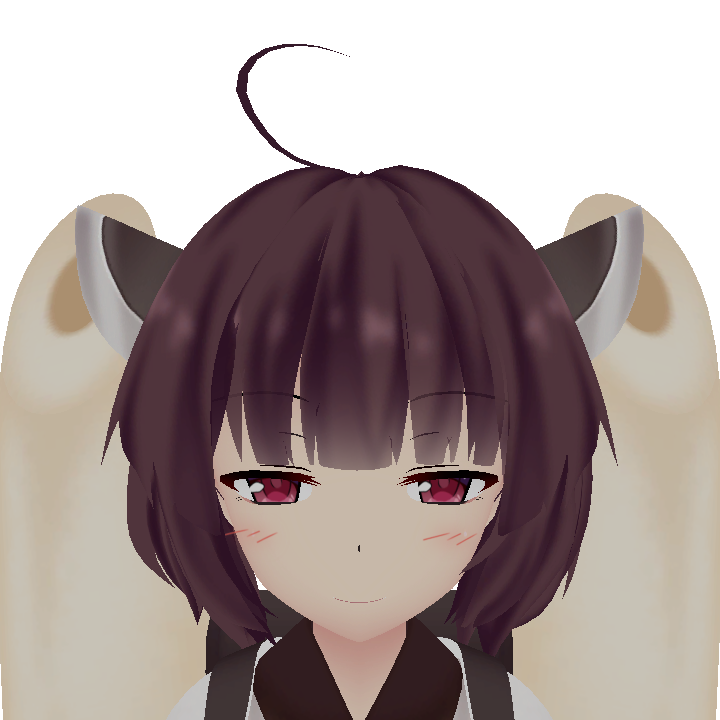 | 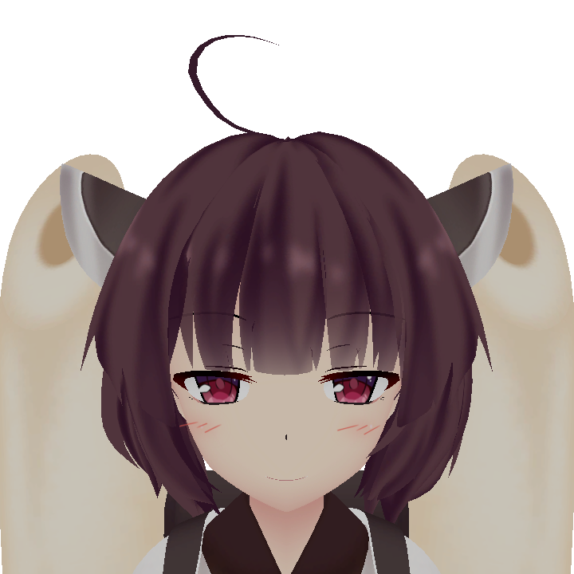 |
| focused_monitor | 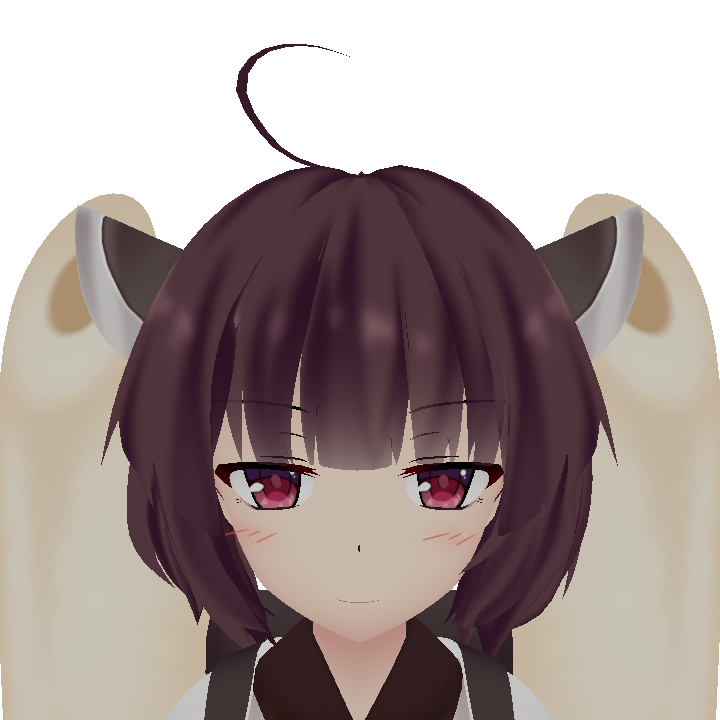 | 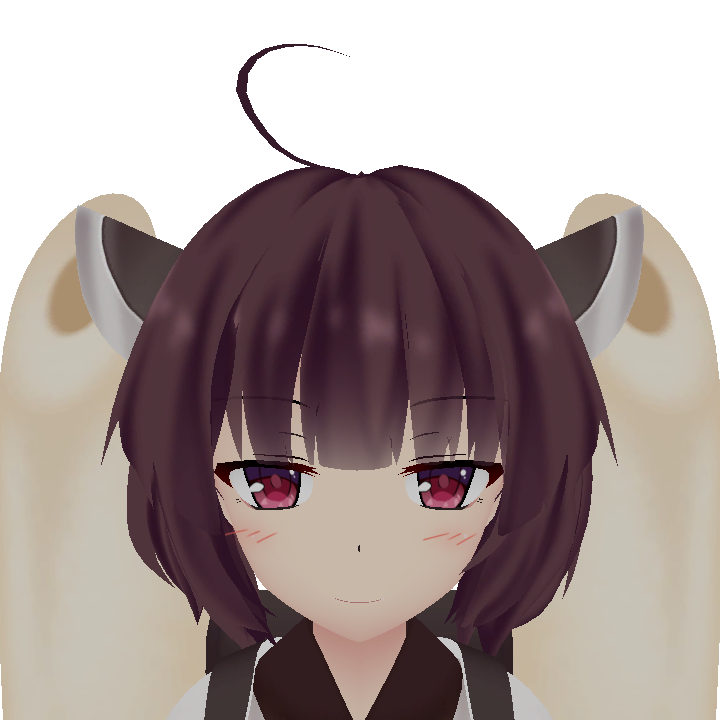 |
| sleepy | 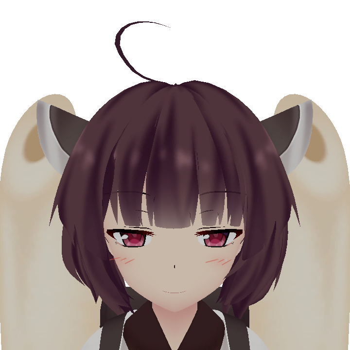 |  |
| bored |  | 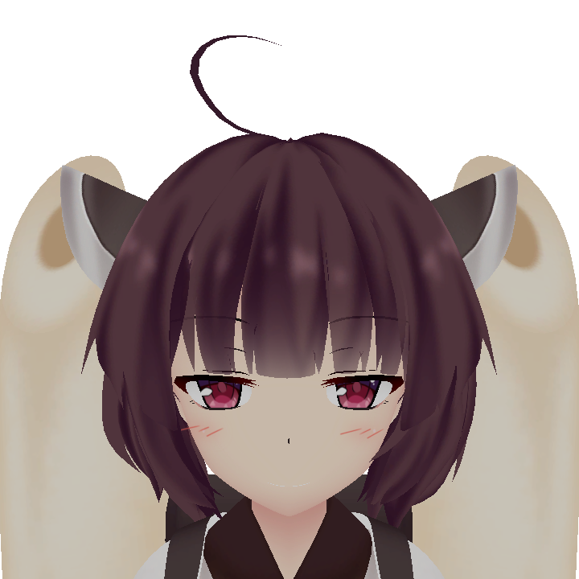 |
| thinking | 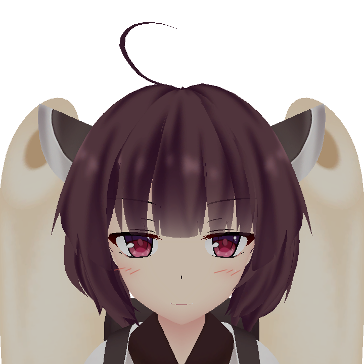 |  |
| wry_smile |  |  |
| surprised_light |  | 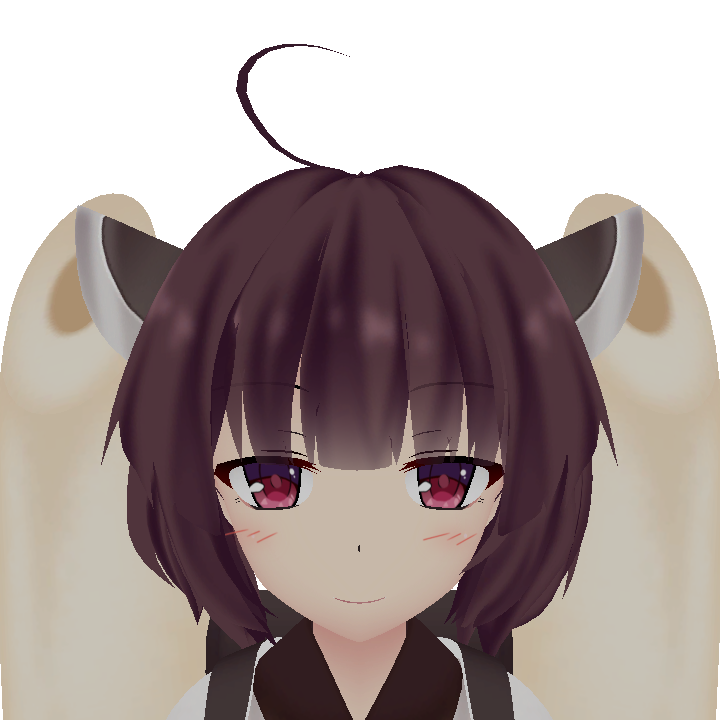 |
| annoyed |  |  |
| sad_soft |  |  |
| smug | 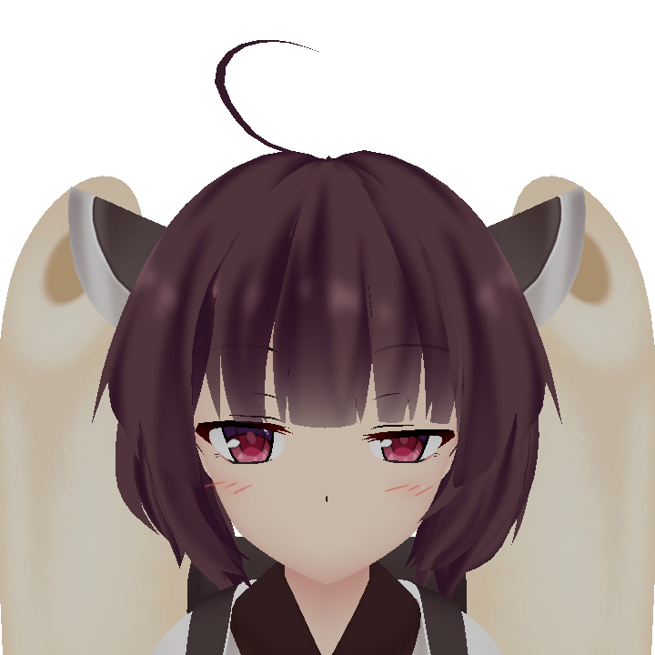 | 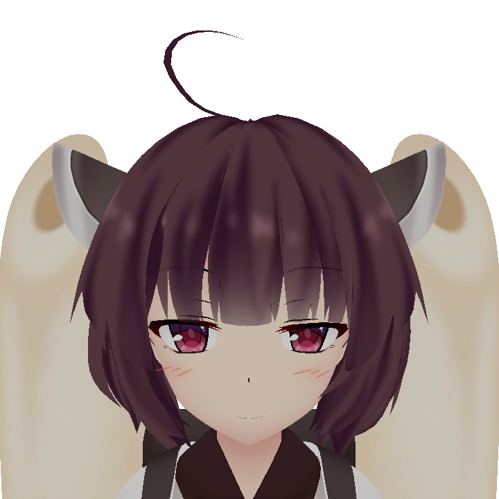 |
| embarrassed | 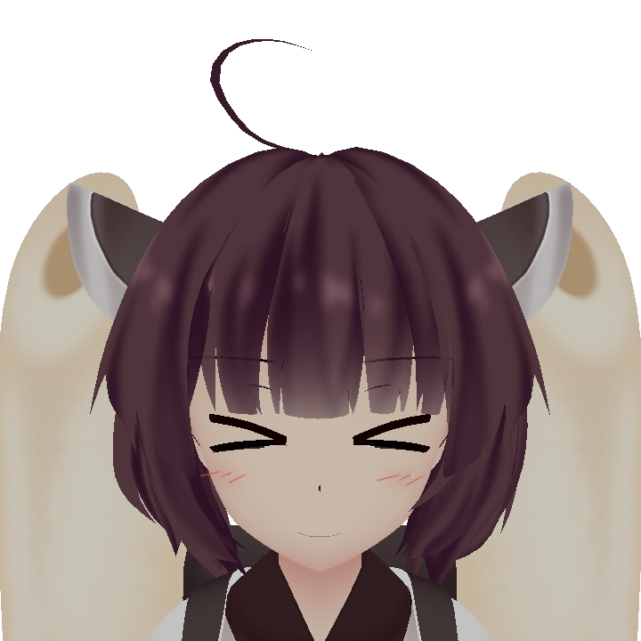 |  |
| yawn | 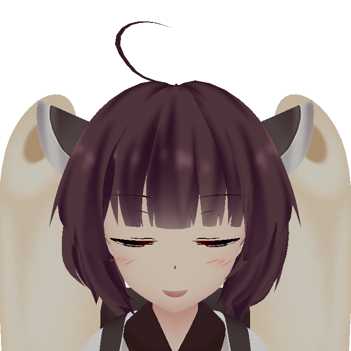 | 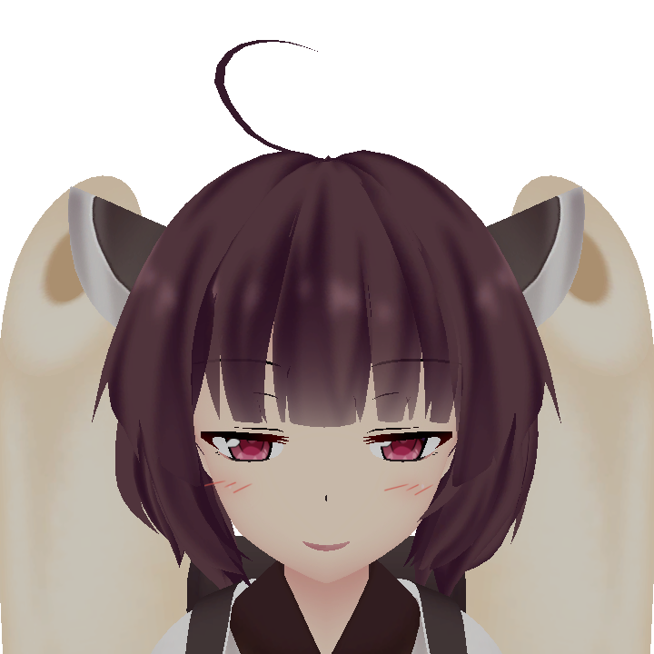 |
